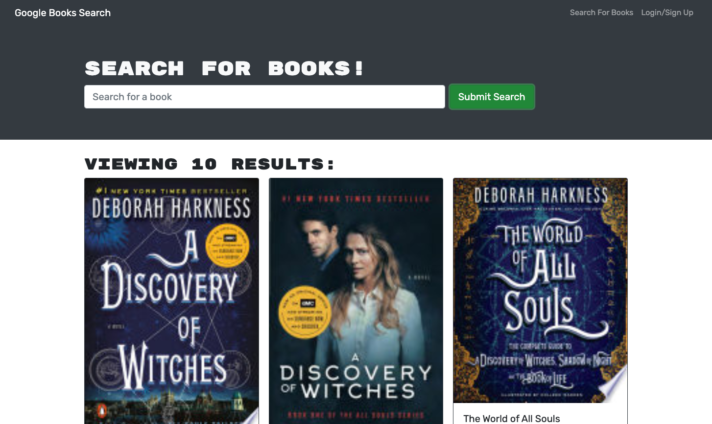

# Book Search

## Table of Contents
- [Description](#description)
- [Installation](#installation)
- [Usage](#usage)
- [License](#license)
- [Contributing](#contributing)
- [Tests](#tests)
- [Questions](#questions)
    
## Description: 
This project was to take a fully functioning Google Books API search engine built with a RESTful API and refactor it to be a GraphQL API built with Apollo Server. This app is built using the MERN stack, with a React front end, MongoDB database, and Node.js/Express.js server and API.

## Installation Instructions: 
To install the necessary dependencies, run the following command in terminal once the respository has been cloned: `npm install`. 

## Usage Information: 
This application allows users to search for books. If logged in, users can save and remove books to their saved page.

## License: 
This project is licensed under the MIT license.

## Contribution Guidelines: 
There are currently no contribution guidelines.

## Test Instructions: 
There are currently no tests.

## Questions: 
If you have questions regarding this project, you can contact me directly at:
* Github: <a href="https://github.com/courtneycaputo">courtneycaputo</a>
* Email: <a href="mailto:courtneycaputo@gmail.com">courtneycaputo@gmail.com</a>